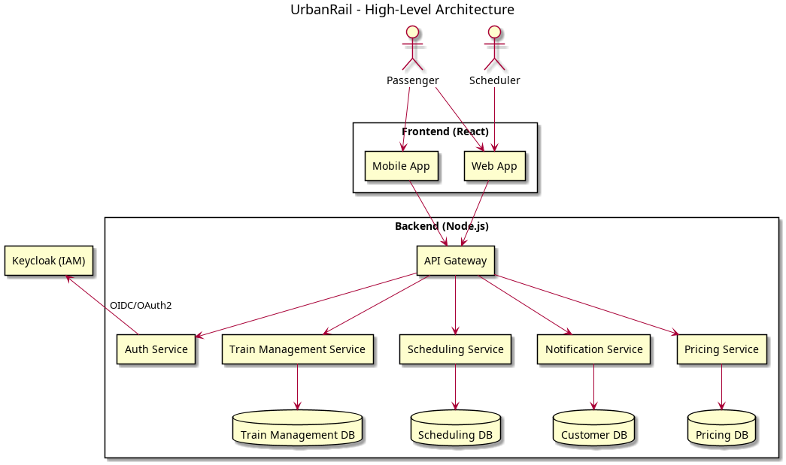

= UrbanRail
:toc: macro
:icons: font
:source-highlighter: rouge
:sectnums:

UrbanRail is a commuter train application designed as an academic project to demonstrate the fundamentals of building modern web applications.  
It provides features for searching trains, viewing fares, and managing schedules.  
This project is a showcase on GitHub of a realistic transit-style system similar to regional transportation services (e.g., RTD).

toc::[]

== Overview

UrbanRail simulates a simplified commuter train system.  
Passengers can:

* Search for available trains by station and time
* View fares based on travel distance or zones
* Purchase tickets using zone numbers
* View schedules and arrival/departure times  

Schedulers/administrators can:

* Modify train arrival/departure times
* Update fare rules
* Manage train routes

== Features

* 🚆 Train search by origin and destination  
* 💵 Fare calculation by distance or zones  
* 📅 Schedules with arrival/departure times  
* 🧾 Ticket purchase simulation  
* 🔑 Role-based access (Passenger vs Scheduler)  
* 🌐 REST API backend with a modern frontend UI  

== Tech Stack

* **Frontend:** React + Vite + Tailwind CSS
* **Backend:** Python FastAPI
* **Database:** PostgreSQL
* **Deployment:** Docker Compose  

== Architecture

The system follows a modular design:

* **Frontend:** React-based UI for passengers and schedulers

* **Backend:** Microservices architecture with REST APIs

== Getting Started

=== Prerequisites
* Git
* Docker & Docker Compose
* Node.js (for frontend dev)
* Python 3.12+ (for backend dev)

=== Clone the Repository
[source,bash]
----
git clone https://github.com/ch88251/urbanrail.git
cd urbanrail
----

=== Running with Docker
[source,bash]
----
docker-compose up --build
----

Frontend will be available at http://localhost:3000  
Backend API at http://localhost:8080  

== Usage

* Visit the frontend UI to search trains, view fares, and simulate ticket purchases.  
* Login as a scheduler to adjust schedules and fares.  

== Roadmap

* ✅ Initial project setup
* ☐ Train search & schedules  
* ☐ Fare calculation  
* ☐ Ticket purchase  
* ☐ Integration with external payment API  
* ☐ Live train status updates

== License

This project is licensed under the MIT License – see the LICENSE file for details.  

== Acknowledgments

* Inspired by real-world commuter rail systems like RTD
* Built for educational/demo purposes only  

